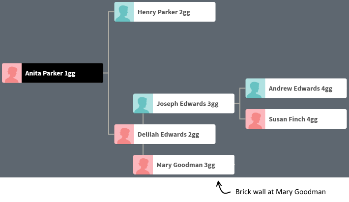
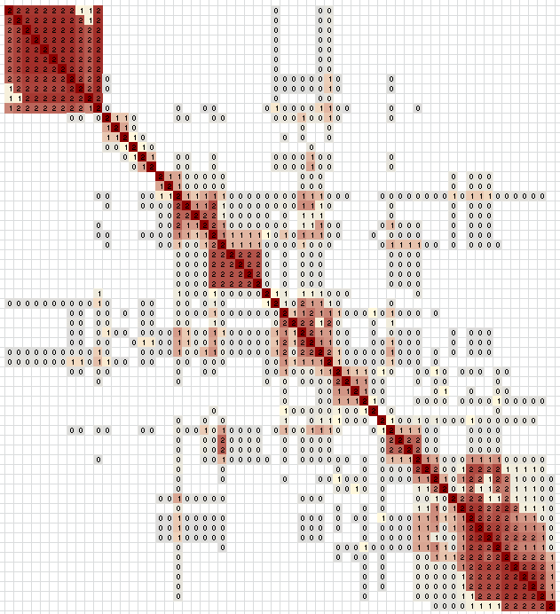
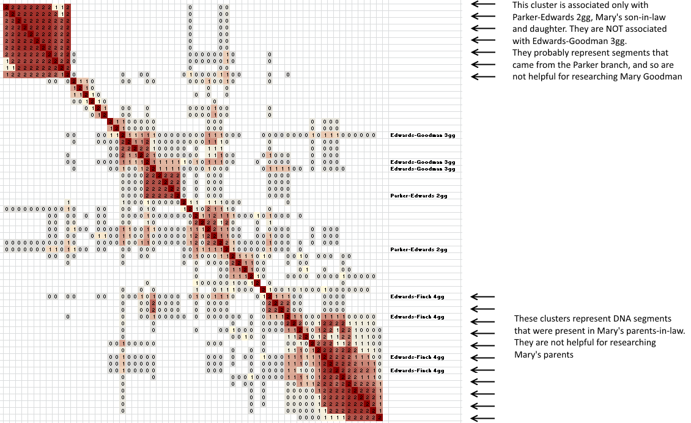
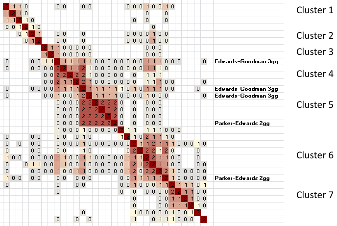

Clustering can offer a lot of insights to the genetic genealogist. Few of those insights are as useful as the ability of clusters to break through brickwalls. This is one real example (with names changed)

## Before clusters

John already built a fairly detailed tree, extending in some cases to his 7th great-grandparents. But not in all cases. He had no information and no leads on the parents of his 3rd great-grandmother Mary Goodman, born in the early 1800s. Part of his tree: including Mary, looked like this:

 

## Cluster analysis

John had been working on his tree for a while, so he already knew a few of the people who were likely related to the Edwards/Goodman branch of his tree. After performing a cluster analysis, he could focus in on the clusters that contained the people that he knew were related to his target. This looks like a mess, but actually there is a huge amount of information here.

 

## Labeling common ancestors

The simplest step after a cluster analysis is simply looking at the public linked and unlinked trees for each match. He was able to combine that with the information he already had, and labeled the most recent common ancestors (MCRAs) for several of the people in these clusters:

 

## Removing unrelated clusters

With the common ancestors labeled, it's easy to see that the bottom few clusters include people who have common ancestors including Andrew Edwards and Susan Finch. Andrew and Susan are Mary's in-laws, so they won't be helpful in understanding Mary's ancestors, so they can be excluded for now.

It's also easy to see the the top left cluster is associated only with clusters containing Henry Parker and Delilah Edwards as common ancestors. That top left cluster is NOT associated with the clusters containing Mary and her husband Joseph Edwards. Most likely this cluster is associated to the Parker branch, through Mary's son-in-law. The Parkers won't be helpful in understanding Mary's ancestors, so this cluster can also be excluded for now.

 

## Edwards clusters

That leaves a small set of 32 matches in 5 clusters that might give some leads on Mary's parents. These clusters contain five matches with known MCRAs of either Mary and her husband or Mary's daughter Delilah and Delilah's husband.

 

Since clusters represent shared DNA segments, all we can say without more information is that any of these 32 people _might_ be related through one of Mary's ancestors. They also might be related through Mary's husband, or through Delilah's in-laws. The next step is to do research: Create quick and dirty trees, and contact these matches and hope that they respond with more information.

Of these, clusters 3, 4 and cluster 5 are particularly interesting because they contain people who have Mary as one of their common ancestors. That means that these clusters couldn't be from the Parker branch. There's a 50/50 chance that each one of these clusters could be the Goodman clusters that John is looking for, and that will lead to Mary Goodman's unknown parents.

Clusters 1, 2, 3, and 7 are are also particularly interesting. Going back to the original clustering diagram, these are the only remaining clusters that are _not_ strongly associated with the excluded Edwards-Finch clusters. In other words, clusters 4, 5, and 6 have red spots if you read down from those clusters and left from the Edwards-Finch clusters. That suggests that clusters 4, 5, and 6 may also represent DNA segments that were inherited from the Edwards branch.

Cluster 3 is the only cluster that is doubly interesting. It is a very small cluster, with only 3 people. And one of those three people is already known to have Mary as a common ancestor, so that isn't helpful for finding Mary's parents. Still, there are two other matches in the cluster that are still unknown. If John is going to look for Mary's parents, then cluster 3 is likely the best bet, followed by clusters 1, 2, and 7.

As soon as even one match in a cluster is identified with ancestors related through Mary's husband or through Delilah's in-laws, that entire cluster can be excluded. Until then, everything is in play. Clustering can focus the research, but the research is still needed!