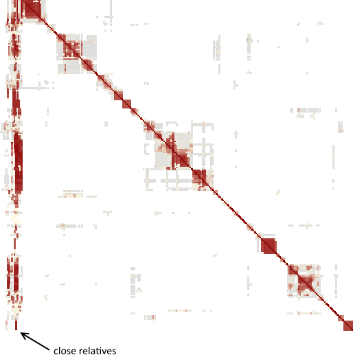

Dark stripes extending the entire height of the cluster diagram indicate very close relatives within about 600 cM or so.

Very close relatives tend not to be helpful when interpreting clusters. Children and grandchildren contribute nothing to the analysis. Parents, aunts/uncles, and first cousins will each match half of the clusters. Grandparents, great aunts/uncles, and second cousins will each match a quarter of the clusters on average. That's better than nothing, of course. Just not a huge help.

Even if not very helpful, it can be interesting to look at the "Morse Code" pattern of red lines for each of the close matches, which show graphically how various DNA segments were transmitted between people. Similar patterns can be seen if the DNA results for each close relative are transferred to a system with a dedicated chromosome browser.

These very long stripes also make it clear how the [Leeds Method](https://www.danaleeds.com/dna-color-clustering-the-leeds-method-for-easily-visualizing-matches/) works, and how it is limited. Just as the very close relatives are shown in the clustering results as stripes that extend across the entire analysis, the same data can be used by the Leeds method to partition the same results by grandparent. The long stripes don't appear except for the closest relatives; for the same reason the Leeds method cannot normally be used to partition results by great-grandparent or earlier generations.

The example above is from a tester with 12 shared matches between 600 and 3500 cM, including children, grandchildren, siblings, and a few first cousins and first cousins once removed.