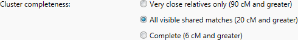
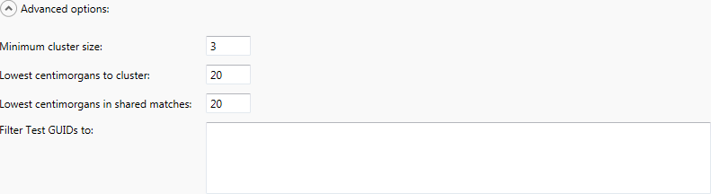
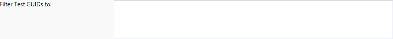

The Cluster tab lets you create cluster diagrams using the data that you downloaded from Ancestry.

## Saved data file

The saved data file is the file that you saved previously using the [Download tab](Download-tab). You can type the path to the file or click the Select button to choose it from disk.

This field will be saved and restored if you relaunch the application.

## Cluster output file

This is the name of the file that will contain the cluster analysis. You can type the path to the file or click the Select button to choose a location to save the file on disk.

This field will be saved and restored if you relaunch the application.

## Cluster completeness

There are three options for cluster completeness:

* Very close relatives only (90 cM and greater)
* All visible shared matches (20 cM and greater)
* Complete (6 cM and greater)

###  Very close relatives only (90 cM and greater)

The first option isn't terribly useful. Most people have relative few very close relatives. You probably have spent a lot of time looking at your close relatives already, and you won't learn much from clustering only your close relatives. This option is provided mainly as an easy way to start clustering, where you can see how the clusters match what you already know.

### All visible shared matches (20 cM and greater)

**The second option is the workhorse of cluster analysis.** If you've been working with your DNA matches for a while, you may already have some idea which of your shared cousin matches seem to "go together". This level of cluster analysis should show you a lot that looks familiar to you, while also giving insights that you haven't thought of before.

### Complete (6 cM and greater)

The third option is the researcher's delight, adding the matches under 20 cM that Ancestry doesn't include in the shared matches. This produces a [much more complex clustering diagram](Distant-matches), but nothing beats a complete analysis in terms of useful data

## Advanced options

The advanced options are provided to give more control over the clustering behavior.

### Minimum cluster size

The minimum cluster size excludes matches that have very few shared matches. The default value is **3** and generally should not be changed. Increasing the value runs the risk of excluding valid matches. Decreasing the value tends to include a lot of false positives that simply distract from research.

The one case where it does make sense to reduce the cluster size is if you are working on a very specific genealogical question, such as trying to break through a brickwall. In a case like that, it might be worth accepting the false positives in order to find every match that might possibly yield the missing clue that you're looking for.

### Lowest centimorgans to cluster

This value is tied to the options for cluster completeness. As discussed above, there are really only two useful values here: 20 cM to include the shared matches visible on the Ancestry website, and 6 cM to include everything (assuming that you have downloaded the low-strength matches in the first place). You _can_ specify other values, but you probably shouldn't. Clusters work best with as much data as possible.

### Lowest centimorgans in shared matches

This value controls which shared matches should be considered when generating clusters, and is also tied to the options for cluster completeness. As discussed above, there are really only two useful values here: 20 cM to include the shared matches visible on the Ancestry website, and 6 cM to include everything (assuming that you have downloaded the low-strength matches in the first place). You _can_ specify other values, but you probably shouldn't. Clusters work best with as much data as possible.

### Filter Test GUIDs to

This section accepts a list of test guids, one per line, and creates a cluster diagram that contains only the matches with those guids. If you're interested in looking at several clusters that are spread out on your main cluster diagram, you can copy the test guids from your original clusters and paste them here. Reclustering in this way can be somewhat easier (and quicker!) than editing the spreadsheet by hand. 

Filtering the clusters to a smaller number of matches can also be helpful when investigating the under-20 cM matches, so that you are not overwhelmed by the huge number of low-strength matches in areas that you are not currently researching.

### Progress bar

The progress bar shows the clustering. 

Clustering progresses in two or three stages. First, the software compares every pair of matches to find which ones are most similar. This stage takes the longest amount of time. Then the clusters are formed by grouping the most similar matches together. If you are clustering he under-20 cM matches, those will be added as a third stage before the cluster report is saved at the end.