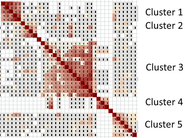
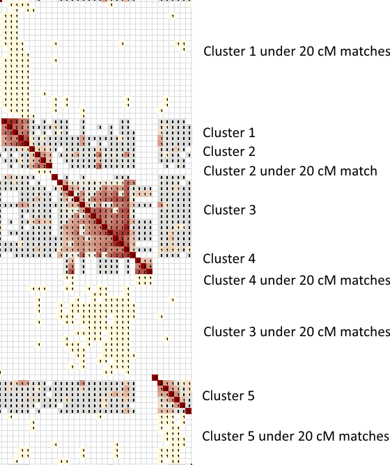

If you take the time to download all of your matches down to the 6 cM minimum, you can cluster all of your matches down to the 6 cM minimum.

Ancestry doesn't show shared matches below 20 cM on their website, and most people have tens of thousands of them. The weak matches only show up in a few places, for example in DNA Circles. They will also sometimes appear as search results if you search your matches by last name and the match has an accurate tree linked to their test results. Hardly anyone has looked at even a small fraction of their matches below 20 cM.

But the low strength matches can have incredibly useful information! There's nothing magical about the 20 cM cutoff used by Ancestry. You can have third cousins far below 20 cM. You can also have eighth cousins far above 20 cM. A clustering diagram groups matches based on similarity without regard to the happenstance of the strength of the match.

A complete clustering analysis produces output that is similar to the over-20 cM cluster, but then goes a step further by adding the matches under 20 cM into the clusters where they belong. Because Ancestry does not show the under-20 cM shared matches, those matches do not contribute to the nice square clusters lined up along the diagonal. Instead, the clusters are more spread out, with the associated under-20 cM matches added above and below each one.

That takes a normal over-20 cM clustering analysis from this:

to this:

Most people have a few hundred to a few thousand matches over 20 cM. Even though only some of the under-20 cM matches can be associated with the over-20 cM clusters, the complete clustering analysis typically includes triple the number of matches as in the over-20 cM clusters by themselves. This is a HUGE resource to the genetic genealogist researcher who has probably never looked at most of those matches before.

The are only a few drawbacks to the complete analysis that prevent it from being the preferred clustering option. The first is obvious, but bears stating: You can't cluster data until you have downloaded that data, and downloading all matches can take a very long time. Also, the sheer amount of data can make the complete clustering report a little overwhelming. And the non-square clusters make it a little more difficult to interpret the clusters if you're not already familiar with what you're looking at.

But in terms of useful data, nothing beats the complete analysis.