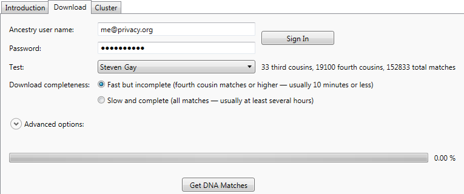
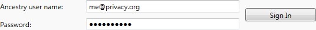
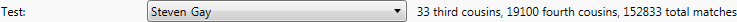
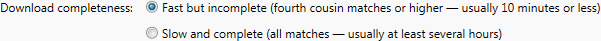
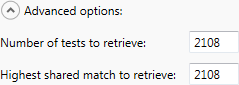
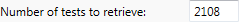

The Download tab lets you download data from Ancestry. You need to download your data before you can cluster it on your local computer.

## Username and password

You must enter your Ancestry DNA username and password and then click Sign In before using the rest of this tab.

The username will be saved, and restored if you quit and relaunch the application. For security, your password will not be saved and must be entered when you need it.

## Test name

The test name lets you specify which test to download data from.

Some people have access to multiple tests, either because they manage tests for several people or because other tests have been shared with them. If you only have access to one test, that will be the only option. 

For convenience, the number of matches in the test is shown to the right of the test name, after the test name is selected.

## Download completeness

There are three options for download completeness:

* Fast but incomplete (fourth cousin matches or higher &#x2014; usually 10 minutes or less)
* Slow and complete (all matches &#x2014; usually at least several hours)

In general, you want to download as much data as possible. But downloading tens of thousands of matches can take a long time. Downloading just the fourth cousin matches is faster than downloading everything.

**Recommendation**: First, download just the fourth cousin matches quickly. Then start a new download to download all matches to a separate file. You can get a lot of information from clustering the fourth cousin matches while waiting for the rest of the data to download, then repeat the clustering when you have all of the data.

**To repeat**: You want as much data as you can get. Really. The clustering cannot be harmed by having more data. The clustering _can_ be harmed by having less data or incomplete data.

## Advanced options

The advanced options are provided to give more control over the two default options for download completeness. If you change the values in the advanced options, then both of the two options for download completeness will be unselected.

Adjusting the advanced options is rarely necessary. It's mainly useful for people with endogamy, who have hundreds of thousands of total matches and thousands of shared matches per match. It can take literally weeks to download that much data, so even tough it's not a good idea to limit the amount of data to be downloaded, sometimes it's necessary just to get something to work with at all.

### Number of tests to retrieve

This value controls how many tests to retrieve, starting from the strongest match. For convenience, the number of third cousin matches, fourth cousin matches, and total matches is shown above, to the right of the test name.

### Highest shared match to retrieve

This value controls how many shared matches should be retrieved for each match. 

Since Ancestry never returns shared matches below 20 cM, the highest meaningful value here is the number of fourth cousin matches, as shown to the right of the test name.

For tests with endogamy, each match may have thousands of shared matches, making clustering both impractical and unhelpful. Downloading only the highest shared matches -- for example, only the top 200 shared matches -- can reduce download time significantly.

**Recommendation**: Don't adjust this value unless you know for sure that the majority of the test matches have hundreds or thousands of shared matches.

### Progress bar

The progress bar shows how much data has been downloaded. 

Downloading progresses in two stages. First, all of the match names are downloaded. This is equivalent to paging through the matches on the Ancestry web site, 50 matches per page. After all of the match names have been downloaded, a second patch downloads the shared matches for each match. Unsurprisingly, the first stage is fairly quick, while most of the download time is spent downloading the shared matches.