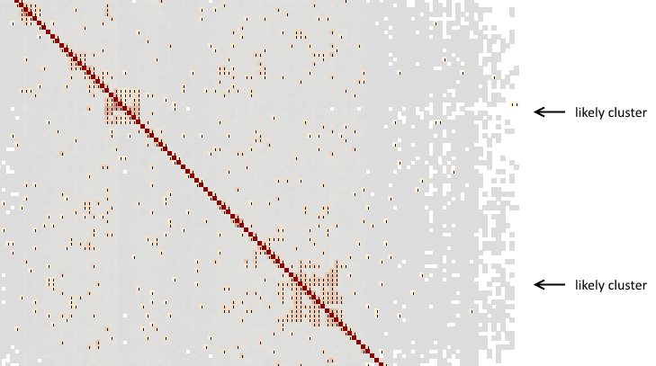

Endogamy is a problem for all tools. In Shared Clustering, endogamy produces large areas of almost solid gray containing "red speckles" instead of nice clear red clusters seen in the absence of endogamy.

 

It _is_ possible to get some information even in the presence of endogamy. The example above shows two likely clusters within the larger see of endogamic matches. In this case, the upper cluster has been confirmed with supporting documentation, while the test taker hasn't yet identified the lower cluster.