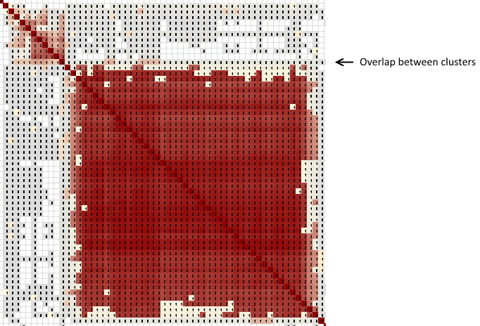
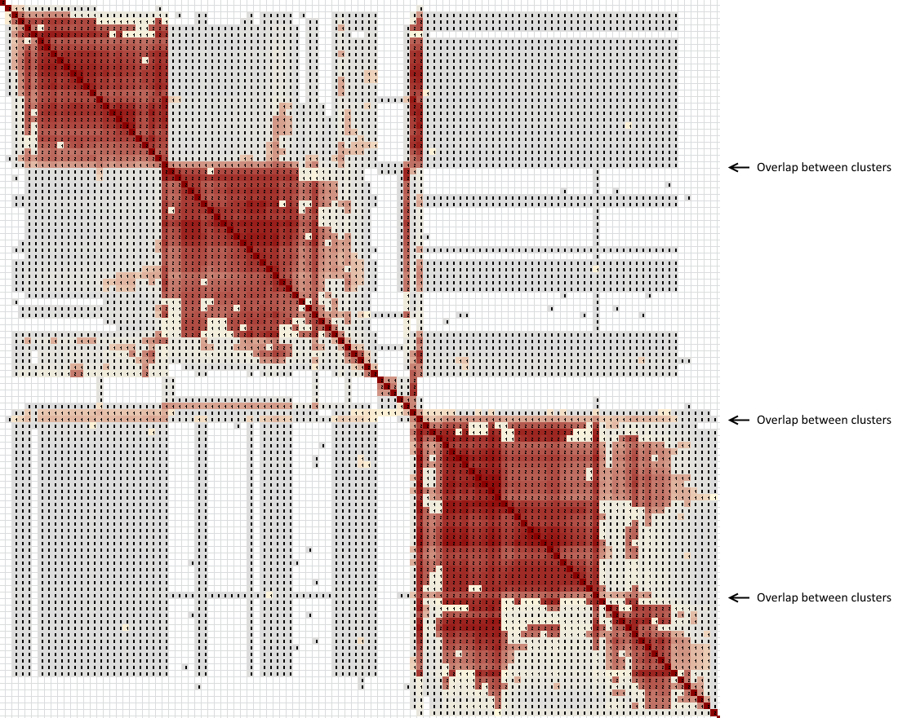
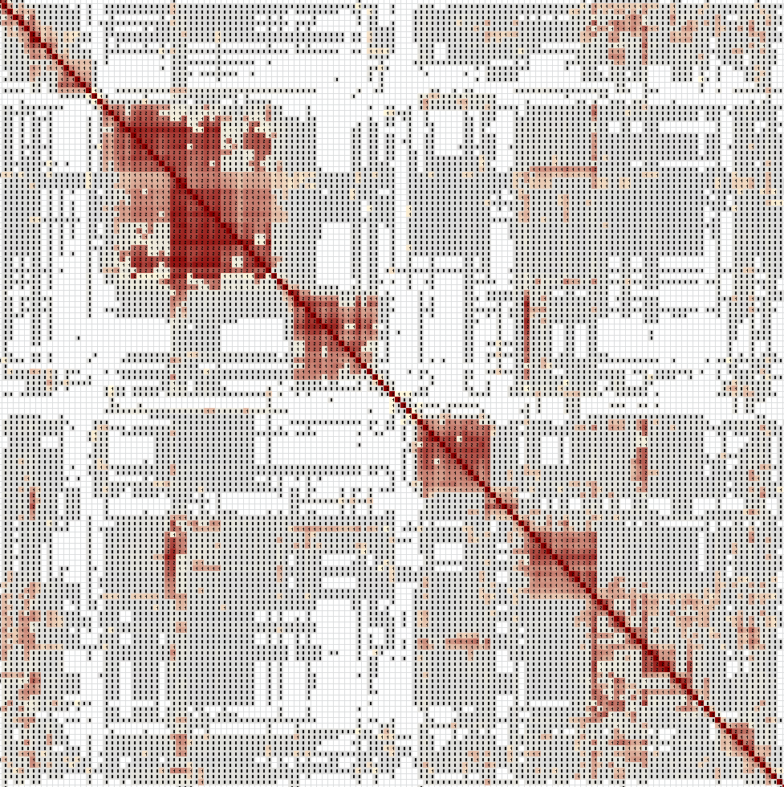

Overlap involving gray areas can be more difficult to interpret.

## Using gray background to highlight overlap

  

Gray background between clusters, or gray background shared between clusters, indicates clusters that are indirectly related. The gray background is also also a very useful part of cluster analysis -- and one of the most annoying because "indirectly related" could mean a lot of things. Small speckles of gray probably don't mean much. Large rectangles as shown here can indicate co-descent in the same way as red overlap.

In the example above, there actually is a direct overlap between the two clusters. The match at the overlap shared 33 cM with the test taker, while the other matches shared 20-25 cM. You can see the overlap a little bit, using the gray background as a hint to look for it.

## Complex overlapping clusters

  

Sometimes clusters can overlap in complex ways. In this example with three large clusters, the top two clusters overlap with one match that shares 70 cM with the test taker. The bottom cluster is very irregular, with dense areas and sparse areas. The members of this cluster share between 20-34 cM with the test taker.

The second and third clusters, however, overlap with three matches of 155, 553, and 105 cM. One of these overlaps with only the second cluster. The second one overlaps with the second and third clusters. The third one overlaps with all three clusters. This is a HUGE lead for interpreting the genealogical relations between clusters!

## Very complex overlapping clusters

  

Gray areas can be extremely complex. When you see an area like the one shown, you can know immediately that all of these clusters are from the same general area of your family tree. This pattern represents a set of DNA segments that co-descended, likely for many generations. Different descendants inherited different combinations of the various segments. Beyond that... there's little to do but research each cluster one by one. If you can identify the common ancestor between the test taker and even one match, you may have a good lead at the common ancestry of everyone.