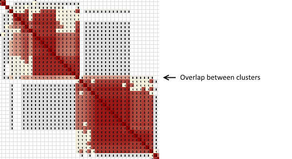
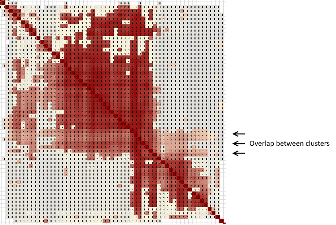

The key to getting the most information out of a cluster analysis is understanding the various ways that clusters can overlap. Overlap is easiest to interpret when it involves the red areas of the clusters.

## Overlapping clusters with small overlap

 

Red overlap between clusters represents matches that share more than one DNA segment with the test taker. These are some of the most useful parts of a clustering analysis for several reasons.

First, because the matches within the overlap area share (at least) two DNA segments with the test taker, they tend to have much higher total shared centimorgans. In the example above, nearly all of the matches have shared centimorgans in the 20-25 cM range -- except for the one match that overlaps both clusters. That one came in at 160 cM, comfortably in the second to third cousin range for this test taker. That's strong enough that you might have already identified the shared ancestor for that match. That's a huge help for identifying the two clusters that overlap. 

Second, if can can identify the common ancestor for you and the overlapping match, you know that the DNA segments represented by those two clusters coexisted in that ancestral pair. This is a GOLDEN tool for breaking through brickwalls. You don't know immediately whether the two segments co-descended, both from the nth-great grandfather or grandmother, or whether they descended independently, one each from the paternal and maternal branches. That's a subject for further research!

## Overlapping clusters with large overlap

  

Overlapping clusters with a large overlap tend to be much less useful than ones with small overlap. These clusters typically represent a largish segment shared among the matches in the overlap area, with the two non-overlapping clusters representing slightly smaller segments on the "left side" or the "right side" of the larger ones. In the example above, matches in the overlap area had shared centimorgans in the 25-30 cM range, while the rest were in the 20-25 cM range. 

Clusters of this sort likely represent a long period of descent, giving time for the presumed original longer segment to get shorter in various ways on either end. Members of this sort of overlapping cluster likely are related through a single common line of descent. That's a big difference from the clusters with small overlap shown earlier. There may be a large spread of common ancestors for the matches within these clusters, with a single cluster possibly including a mix of third cousins through eighth or even more distant cousins.ons between the three clusters!