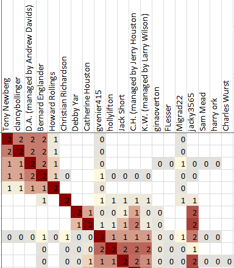

Part of the value in clustering is in the clusters themselves. You can learn a lot from looking at just the clusters. But you can learn even more when you start recognizing the relationships between clusters.

Each cell in the cluster diagram is part of a row and a column. The information in the cell gives information about how the person listed in the row header is associated with the person in the column header.

### Cell colors

Two pieces of information are most important, and are represented by the red and gray colors. 

A red color means that the the person in the column header is included in the shared match list between the test taker and the person in the row header. 

A gray color means that the person in the column header is _not_ included in the shared match list between the test taker and the person in the row header, but both of those people _are_ included in the shared match list of some other person. 

In short, a red color indicates two people who very likely share some DNA segment. A gray color indicates two people who do not share DNA directly between them, but likely do share DNA with the same third person. A red color indicates people who are likely on the same line of descent. A gray color indicates people who might be on the same line of descent, or might be on two different lines of descent that are joined by marriage at some earlier generation in your tree.

## Examples

* [Clusters with red overlap](https://github.com/jonathanbrecher/sharedclustering/wiki/Interpreting-clusters-with-red-overlap)
* [Clusters with gray overlap](https://github.com/jonathanbrecher/sharedclustering/wiki/Interpreting-clusters-with-gray-overlap)
* [Isolated clusters](https://github.com/jonathanbrecher/sharedclustering/wiki/Interpreting-isolated-clusters)
* [Close relatives](https://github.com/jonathanbrecher/sharedclustering/wiki/Close-relatives)
* [Endogamy](https://github.com/jonathanbrecher/sharedclustering/wiki/Endogamy)

## No, really, what do the colors mean?

...and what do the numbers in each cell mean also?

All right, all right. The colors are the most important part, but here's the rest of the details for the sake of anyone who just has to know exactly what they're looking at.

Shared Clustering works by looking at the _frequency_ of how often each pair of matches appear together in the same match list. That frequency is shown with a scale from 0 to 1. 

Consider two matches, Amy and Bill. If Amy and Bill never ever appear in the same shared match list, then they are correlated with a frequency of 0. Zero values are shown as blanks in the cluster output.

If every shared match list that includes Amy also includes Bill, then they are correlated with a frequency of 1. If half of the shared match lists that include Amy also include Bill, then they are correlated with a frequency of 0.5, and so on.

As a special cases, if Bill shows up on Amy's _own_ shared match list, then the frequency gets an extra +1, producing a range from 1...2 instead of 0...1. 

The values in the range of 0...1 are shown in shades of gray. The ones in the range of 1...2 are shown in shades of red.

Note that the correlations are not symmetric. Even if every shared match list that includes Amy also includes Bill, that does _not_ guarantee that every shared match list that includes Bill also includes Amy.

This asymmetry can be seen most clearly for [very close relatives](Close-relatives) such as parents. If your mother has been tested, then every maternal match also includes your mother in their shared matches. But if Cindy is one of your maternal relatives, then she may be included in only a very small fraction of the match lists that include your mother. This results in very dark vertical red stripes in the columns for close relatives, but very light horizontal stripes for in the rows.

### OK, but why those numbers?

Mostly, just "because". I tried a lot of different ways to measure the correlation between matches. I've left some of the failed attempts visible in the source code so that other people can think about different approaches. I went with the approach that produced the clusters that I thought looked the best. 

Deciding what clusters looked the best is also a judgement call. In general, I looked for a smaller number of larger clusters, ideally with the associated clusters near each other on the cluster diagram. There are lots of different ways to make valid clusters, since many matches could be included in more than one cluster. There isn't a single correct answer.