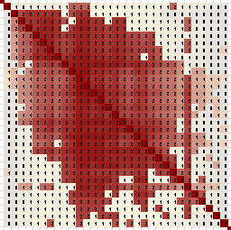
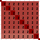
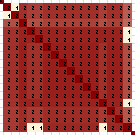

Isolated clusters are clusters that have no overlap with other clusters. In other words, if you follow horizontally or vertically from the cluster, you find no significant areas of red or gray. There might be some speckles, but no large areas other than just white. 

## Sparse clusters

  

Sparse clusters have a gray background filling out the square pattern behind a very non-square pattern of red. These clusters represent matches with an irregular pattern of overlapping shared DNA segments. Each member of the cluster overlaps with some of the others... But ALL of the cluster members match some of the others, making a valid cluster even if not a perfect one.

Clusters of this sort can be interesting because they tend not to be obvious when looking at matches by hand. You may not have noticed this clusters before, even if you've been working with your matches for a while. For that reason, they might have some useful surprises.

Sparse clusters may contain close or distant cousins. They can be useful if you can identify a few people in the cluster to give guidance on the rest.

## Simple perfect or nearly perfect clusters

  

 

The simplest clusters look like perfect or nearly perfect squares with little or no gray surrounding them. These clusters represent groups of matches where all or nearly all matches appear in the in the list of shared matches from nearly every other match. In most cases there is a single DNA segment shared almost exactly by all members of the cluster.

These clusters are very seducing. They look so good on the screen, they practically scream for attention.

Unfortunately, very simple, fully isolated clusters tend to be the least useful as genealogical tools. For starters, these clusters are very easy to find by hand, so you very likely know about them already if you've been working with your DNA results for a while. If you look at the shared match list for any one of them, it will list all of the other members of the cluster very neatly with little other distraction.

These clusters often represent distant cousins, with most recent common ancestors as far back as 8th-great-grandparents or older. You can learn a lot from these clusters, but only if you already have your tree extended that far back. Otherwise, it can be easiest to start somewhere else.