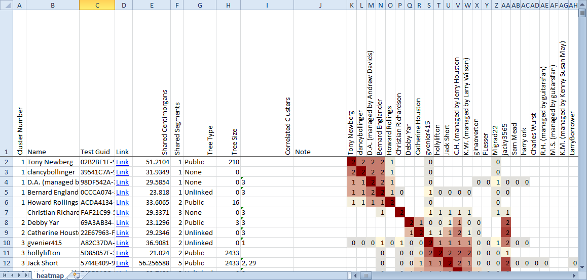
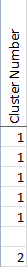
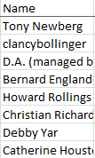
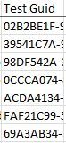
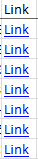
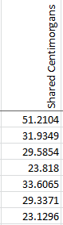
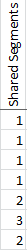
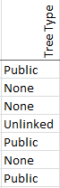
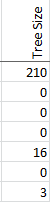
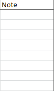

Shared Clustering saves its output in a .xlsx spreadsheet. Most of the spreadsheet is occupied by the clusters themselves. The headers of each row and column provide other information about the matches in each cluster.

## Cluster Number

Each cluster recognized by Shared Clustering is numbered, starting at 1 at the top of the file. The numbers are completely arbitrary; Cluster 1 isn't any more important than cluster 10 or cluster 100. These numbers simply provide a way to refer to the clusters, for example in the Correlated Clusters column.

Sometimes it can be hard to tell where one cluster ends and another begins. This is especially true when the clusters overlap. Remember that the numbers are arbitrary. You should make your own interpretations.

## Name

This is the name of the match, as shown in the Ancestry DNA results.

## Test Guid

The Test Guid is a way that Ancestry uses to identify each test uniquely. It's possible for two people to have the same names. It is not possible for two people to have the same [guid](https://betterexplained.com/articles/the-quick-guide-to-guids/). Even if one person takes the test twice, each test will have a different guid.

Shared Clustering can use the test guids to produce custom reports showing a subset of the total matches.

## Link

The Link is a clickable hyperlink that will open the test results for that match in your default browser.

## Centimorgans

The Centimorgans value is a standard measure of the strength of a match. Higher values indicate stronger matches. Most values tend to be fairly low.

The Ancestry DNA website only shows matches of at least 20 centimorgans in the shared match lists. Shared Clustering can include matches down to 6 centimorgans, which is the absolute lowest limit of the results returned by Ancestry.

## Shared Segments

While the Centimorgans value shows the total strength of each match, the Shared Segments value shows how many segments those centimorgans are split into. Weak matches tend to share only a single segment. Strong matches can share a dozen or more segments.

## Tree Type

It can be helpful to know if each match has a tree linked to their DNA results. If you are trying to do research based on family names or locations and the match doesn't have any tree linked to their results at all, there's no point even opening the test results.

Possible tree types include:

* None
* Unlinked
* Private
* Public

## Tree Size

Sometimes trees have only one or two people. That's hardly any more helpful than having no tree at all.

Unlinked trees always report a zero tree size.

## Correlated Clusters

If a row is correlated with other clusters, the numbers of those clusters (from the first column in the spreadsheet) will be shown in this column. 

Two clusters are correlated (or associated) when you can read horizontally from one cluster and vertically from another cluster and find some red squares in the intersection. Those red squares outside of the main clusters indicate matches that could be part of both clusters. Another way to say the same thing is that the shared match lists for those people include shared matches that are included in both clusters. 

There are lots of reasons that one match might appear in several clusters, and many of the reasons are unhelpful to a genetic genealogist. If one or two members of a cluster are correlated with another cluster, that probably doesn't mean much. Correlated clusters become interesting when many matches are correlated between the same clusters. In the example shown here, cluster 3 appears as a correlated cluster for several matches. That is probably worth some time for a researcher to investigate.

## Note

If you used the note feature on the Ancestry website to attach comments to your matches, those notes will be repeated here for convenience. This can save a lot of time when interpreting the clusters, since you have easy access to the research you have already completed.

## Clusters

The main part of the spreadsheet shows the clusters themselves. The clusters are shown as red squares arranged on the diagonal. Each red square includes a group of matches that are more similar -- based on the shared matches of each match -- to each other than to any of the other matches.

More about the cluster output can be seen in the discussions of [Interpreting clusters](https://github.com/jonathanbrecher/sharedclustering/wiki/Interpreting-clusters).