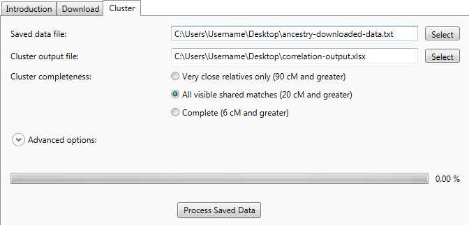

The fastest way to get some good, useful results is to perform a cluster analysis on your matches over 20 cM ("4th cousin" and closer). That gives provides clusters included all matches that Ancestry displays in shared match lists, and usually takes only a few minutes to run.

## Download

Go to the Download tab:

1. Enter your Ancestry DNA name and password, then click Sign In.
2. Select the 'Fast but incomplete' option.
3. Click Get DNA Matches. You will be prompted for a location to save the downloaded data.
4. Wait until the progress bar reports that it is Done.

## Cluster

Go to the Cluster tab:

1. Select the file that you just downloaded
2. Select the file where you will save the correlated clusters.
3. Select the 'All visible shared matches' option.
4. Click Process Saved Data.
5. Wait until the progress bar reports that it is Done.